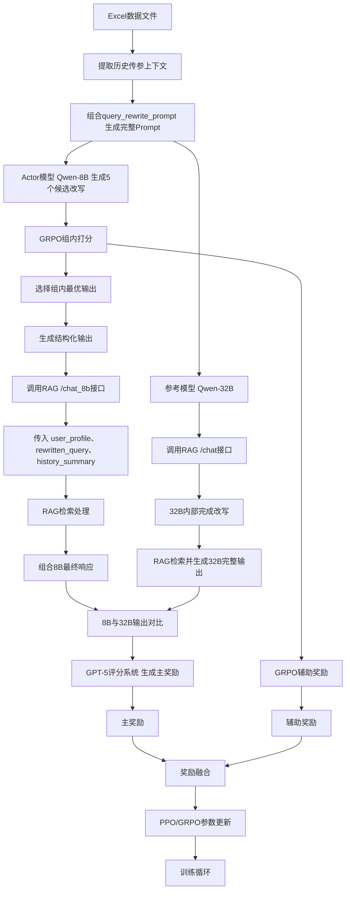

# SalesRAG Query改写GRPO+GPT-5混合架构设计 v4.0

## 📋 概述

基于GRPO组内竞争机制，结合GPT-5质量评估，设计**GRPO选择+GPT-5评分的混合训练架构**。本方案利用GRPO的组内优化能力筛选最优候选，再通过GPT-5评估绝对质量，实现高效、稳定的query改写强化学习训练。

### 核心创新点

1. **GRPO组内竞争**: Actor模型生成5个候选改写，通过log-prob和语义质量选出最优
2. **GPT-5主奖励**: 对最优候选进行双模型对比评分，提供绝对质量信号
3. **混合奖励机制**: GPT-5主奖励(80-90%) + GRPO辅助奖励(10-20%)
4. **高效训练**: 仅对组内最优输出进行外部评分，大幅降低GPT-5调用成本

## 🏗️ 核心架构设计
混合GRPO架构 v4.0:
├── verl_code/verl/workers/grpo_selector.py                 # GRPO组内选择器（新增）
├── verl_code/verl/workers/gpt5_quality_evaluator.py        # GPT-5质量评估器（重构）
├── verl_code/verl/workers/hybrid_reward_combiner.py        # 混合奖励合成器（新增）
├── verl_code/verl/trainer/main_ppo.py                      # 主训练入口（修改）
├── verl_code/verl/trainer/config/ppo_trainer.yaml          # 扩展配置文件
├── scripts/run_grpo_gpt5_hybrid.sh                         # 训练启动脚本
└── deprecated/v3_dual_model_backup/                        # v3版本备份


### 1. 系统架构图



### 2. 核心组件说明

#### 2.1 GRPO组内选择器
- **功能**: 从5个候选改写中选择最优输出
- **选择依据**: 
  - log-prob（生成概率）
  - 语义流畅度
  - 语法自然度
  - 初步检索效果（可选）
- **输出**: 组内最优的1个改写

#### 2.2 GPT-5质量评估器（主奖励）
- **输入**: GRPO选出的最优改写 + 32B参考改写
- **评估维度**: 
  - 质量提升度（40%）
  - 相关性准确性（20%）
  - 信息完整性（20%）
  - 检索有效性（20%）
- **输出**: 绝对质量分数 [0, 1]
- **权重**: 0.8-0.9（主奖励）

#### 2.3 混合奖励合成器
- **主奖励**: GPT-5评分（权重0.8-0.9）
- **辅助奖励**: GRPO组内优势（权重0.1-0.2）
- **合成策略**: 加权求和
- **最终输出**: 用于PPO更新的奖励信号

#### 2.4 RAG接口适配器
- **8B接口**: `/rag/chat_8b`
  - 输入：`user_profile`, `rewritten_query`, `history_summary`
  - 特点：接收外部改写的query，直接进行检索
- **32B接口**: `/rag/chat`
  - 输入：原始上下文
  - 特点：32B模型内部完成query改写，然后检索
- **作用**: 确保8B和32B使用相同的RAG检索逻辑进行公平对比

## 🔧 技术实现细节

### 3.1 GRPO组内选择

#### 3.1.1 候选生成与打分
```python
def generate_and_score_candidates(
    prompt: str, 
    actor_model, 
    group_size: int = 5
) -> Tuple[List[str], List[float]]:
    """
    生成多个候选改写并计算GRPO分数
    """
    candidates = []
    log_probs = []
    
    # 生成多个候选（不同温度保证多样性）
    temperatures = [0.6, 0.7, 0.8, 0.9, 1.0]
    
    for temp in temperatures:
        output = actor_model.generate(
            prompt,
            temperature=temp,
            return_log_prob=True,  # 返回log概率
            max_new_tokens=512
        )
        candidates.append(output['text'])
        log_probs.append(output['log_prob'])
    
    # GRPO组内打分：基于log_prob
    grpo_scores = compute_grpo_scores(log_probs)
    
    return candidates, grpo_scores

def compute_grpo_scores(log_probs: List[float]) -> List[float]:
    """
    计算GRPO组内相对分数
    """
    # 组内标准化
    mean_lp = np.mean(log_probs)
    std_lp = np.std(log_probs)
    
    if std_lp < 1e-8:
        return [0.0] * len(log_probs)
    
    # 标准化分数
    grpo_scores = [(lp - mean_lp) / std_lp for lp in log_probs]
    
    return grpo_scores
```

#### 3.1.2 选择最优候选
```python
def select_best_candidate(
    candidates: List[str],
    grpo_scores: List[float]
) -> Tuple[str, float]:
    """
    选择GRPO分数最高的候选
    """
    best_idx = np.argmax(grpo_scores)
    best_candidate = candidates[best_idx]
    best_score = grpo_scores[best_idx]
    
    return best_candidate, best_score
```

### 3.2 GPT-5质量评估（主奖励）

#### 3.2.1 双模型对比评分
```python
async def evaluate_with_gpt5(
    best_candidate: str,
    reference_output: str,
    rag_results: Dict
) -> float:
    """
    使用GPT-5评估最优候选的质量
    
    Returns:
        float: 质量分数 [0, 1]
    """
    # 构建评估prompt
    eval_prompt = build_comparison_prompt(
        actor_output=best_candidate,
        reference_output=reference_output,
        rag_results=rag_results
    )
    
    # 调用GPT-5评分
    gpt5_result = await gpt5_rater.rate(eval_prompt)
    
    # 提取质量分数
    quality_score = extract_quality_score(gpt5_result)
    
    return quality_score

def extract_quality_score(gpt5_result: Dict) -> float:
    """
    从GPT-5结果中提取质量分数
    
    Returns:
        float: [0, 1]范围的分数
            - 0.9-1.0: 8B明显优于32B
            - 0.7-0.9: 8B略优于32B
            - 0.5-0.7: 相当
            - 0.3-0.5: 32B略优于8B
            - 0.0-0.3: 32B明显优于8B
    """
    better = gpt5_result.get('better', 'same')
    scores_8b = gpt5_result.get('score', {}).get('8b', {}).get('sum', 20)
    scores_32b = gpt5_result.get('score', {}).get('32b', {}).get('sum', 20)
    
    # 计算相对质量
    if better == '8b':
        # 8B更好，映射到[0.7, 1.0]
        quality = 0.7 + (scores_8b / 40.0) * 0.3
    elif better == '32b':
        # 32B更好，映射到[0.0, 0.5]
        quality = 0.5 - (scores_32b / 40.0) * 0.5
    else:
        # 相当，映射到[0.5, 0.7]
        quality = 0.5 + (scores_8b / 40.0) * 0.2
    
    return np.clip(quality, 0.0, 1.0)
```

### 3.3 混合奖励合成

#### 3.3.1 奖励融合
```python
def compute_final_reward(
    gpt5_quality: float,
    grpo_advantage: float,
    gpt5_weight: float = 0.85,
    grpo_weight: float = 0.15
) -> float:
    """
    合成最终训练奖励
    
    Args:
        gpt5_quality: GPT-5质量评分 [0, 1]
        grpo_advantage: GRPO组内优势 (标准化后)
        gpt5_weight: GPT-5权重 (推荐0.8-0.9)
        grpo_weight: GRPO权重 (推荐0.1-0.2)
    
    Returns:
        float: 最终奖励信号
    """
    # 将GPT-5分数映射到[-1, 1]范围（以0.5为中心）
    gpt5_reward = (gpt5_quality - 0.5) * 2.0
    
    # 加权融合
    final_reward = gpt5_weight * gpt5_reward + grpo_weight * grpo_advantage
    
    return final_reward
```

### 3.4 完整训练流程

#### 3.4.1 单步训练流程
```python
class HybridGRPOGPT5Trainer:
    async def train_step(self, batch: Dict) -> Dict:
        """
        单步训练流程
        
        流程:
        1. Actor生成5个候选改写
        2. GRPO组内打分，选择最优
        3. RAG检索
        4. GPT-5评估最优候选
        5. 合成混合奖励
        6. PPO参数更新
        """
        all_rewards = []
        all_best_candidates = []
        
        for prompt_data in batch:
            # 步骤1: 生成候选并GRPO打分
            candidates, grpo_scores = generate_and_score_candidates(
                prompt=prompt_data['prompt'],
                actor_model=self.actor_model,
                group_size=5
            )
            
            # 步骤2: 选择最优候选
            best_candidate, grpo_advantage = select_best_candidate(
                candidates, grpo_scores
            )
            
            # 步骤3: RAG检索
            rag_results = await self.rag_retriever.retrieve(
                query=best_candidate
            )
            
            # 步骤4: 获取32B参考输出
            reference_output = await self.get_reference_output(
                prompt=prompt_data['prompt']
            )
            
            # 步骤5: GPT-5评估
            gpt5_quality = await evaluate_with_gpt5(
                best_candidate=best_candidate,
                reference_output=reference_output,
                rag_results=rag_results
            )
            
            # 步骤6: 合成最终奖励
            final_reward = compute_final_reward(
                gpt5_quality=gpt5_quality,
                grpo_advantage=grpo_advantage,
                gpt5_weight=0.85,
                grpo_weight=0.15
            )
            
            all_rewards.append(final_reward)
            all_best_candidates.append(best_candidate)
        
        # 步骤7: PPO参数更新
        loss = self.ppo_update(
            candidates=all_best_candidates,
            rewards=all_rewards
        )
        
        return {
            'rewards': all_rewards,
            'gpt5_quality': [r['gpt5'] for r in all_rewards],
            'grpo_advantages': [r['grpo'] for r in all_rewards],
            'loss': loss
        }
```

#### 3.4.2 批量并行处理
```python
async def batch_train_step(self, batch: List[Dict]) -> Dict:
    """
    批量并行处理，提高效率
    """
    # 并行生成所有候选
    generation_tasks = [
        generate_and_score_candidates(item['prompt'], self.actor_model)
        for item in batch
    ]
    all_candidates_scores = await asyncio.gather(*generation_tasks)
    
    # 选择最优候选
    best_candidates = [
        select_best_candidate(cands, scores)
        for cands, scores in all_candidates_scores
    ]
    
    # 并行RAG检索
    rag_tasks = [
        self.rag_retriever.retrieve(cand)
        for cand, _ in best_candidates
    ]
    rag_results = await asyncio.gather(*rag_tasks)
    
    # 并行GPT-5评估（批量调用降低成本）
    gpt5_tasks = [
        evaluate_with_gpt5(cand, ref, rag)
        for (cand, _), ref, rag in zip(
            best_candidates,
            [item['reference'] for item in batch],
            rag_results
        )
    ]
    gpt5_qualities = await asyncio.gather(*gpt5_tasks)
    
    # 合成奖励
    final_rewards = [
        compute_final_reward(gpt5_q, grpo_adv)
        for gpt5_q, (_, grpo_adv) in zip(gpt5_qualities, best_candidates)
    ]
    
    return final_rewards
```

### 3.3 兼容性保证

#### 3.3.1 官方GRPO接口兼容
```python
# 保持与官方verl的GRPO接口兼容
def compute_grpo_outcome_advantage(
    token_level_rewards: torch.Tensor,
    response_mask: torch.Tensor,
    index: torch.Tensor,
    norm_adv_by_std_in_grpo: bool = True
) -> Tuple[torch.Tensor, torch.Tensor]:
    """
    与官方实现完全兼容的GRPO优势计算
    """
    # 使用官方实现作为基础
    advantages, returns = official_grpo_implementation(
        token_level_rewards, response_mask, index, norm_adv_by_std_in_grpo
    )
    
    # 添加辅助奖励信号
    if hasattr(self, 'auxiliary_rewards'):
        advantages = self.apply_auxiliary_rewards(advantages)
    
    return advantages, returns
```

#### 3.5.2 配置文件
```yaml
# GRPO+GPT-5混合训练配置
algorithm:
  adv_estimator: grpo
  norm_adv_by_std_in_grpo: true
  use_kl_in_reward: false
  
  # 混合训练参数
  hybrid_grpo_gpt5:
    enable: true
    
    # GRPO组内选择
    group_size: 5  # 每个prompt生成5个候选
    selection_method: "max_log_prob"  # 选择方法：max_log_prob, weighted_sample
    
    # GPT-5评估
    gpt5_weight: 0.85  # GPT-5主奖励权重 (0.8-0.9)
    grpo_weight: 0.15  # GRPO辅助奖励权重 (0.1-0.2)
    
    # 评估配置
    gpt5_model: "GPT-5"
    gpt5_batch_size: 8  # GPT-5批量评估大小
    gpt5_timeout: 10.0  # GPT-5调用超时(秒)
    
    # RAG检索
    rag_endpoint: "http://localhost:8000/chat_8b"
    reference_endpoint: "http://localhost:8000/chat"  # 32B参考模型
```

---

## 🔨 代码修改指南

### 修改1: 创建GRPO组内选择器

**新建文件**: `verl_code/verl/workers/grpo_selector.py`

```python
"""
GRPO组内选择器
功能：从多个候选改写中选择最优输出
"""

import numpy as np
from typing import List, Tuple, Dict
import torch
import logging

logger = logging.getLogger(__name__)


class GRPOSelector:
    """GRPO组内选择器"""
    
    def __init__(self, selection_method: str = "max_log_prob"):
        """
        Args:
            selection_method: 选择方法
                - "max_log_prob": 选择log_prob最高的
                - "weighted_sample": 按log_prob加权采样
        """
        self.selection_method = selection_method
    
    def select_best(
        self,
        candidates: List[str],
        log_probs: List[float]
    ) -> Tuple[str, float, int]:
        """
        从候选中选择最优
        
        Args:
            candidates: 候选改写列表
            log_probs: 对应的log概率
            
        Returns:
            (best_candidate, grpo_advantage, best_idx)
        """
        if not candidates or not log_probs:
            raise ValueError("候选列表不能为空")
        
        if len(candidates) != len(log_probs):
            raise ValueError("候选数量与log_prob数量不匹配")
        
        # 计算GRPO组内相对分数
        grpo_scores = self._compute_grpo_scores(log_probs)
        
        # 选择最优
        if self.selection_method == "max_log_prob":
            best_idx = np.argmax(grpo_scores)
        elif self.selection_method == "weighted_sample":
            # 按分数加权采样
            weights = np.exp(grpo_scores - np.max(grpo_scores))
            weights = weights / np.sum(weights)
            best_idx = np.random.choice(len(candidates), p=weights)
        else:
            raise ValueError(f"未知的选择方法: {self.selection_method}")
        
        best_candidate = candidates[best_idx]
        grpo_advantage = grpo_scores[best_idx]
        
        logger.info(f"GRPO选择: 候选{best_idx}, 优势={grpo_advantage:.3f}")
        
        return best_candidate, grpo_advantage, best_idx
    
    def _compute_grpo_scores(self, log_probs: List[float]) -> np.ndarray:
        """
        计算GRPO组内相对分数（标准化）
        
        Args:
            log_probs: log概率列表
            
        Returns:
            标准化后的GRPO分数
        """
        log_probs_array = np.array(log_probs, dtype=np.float32)
        
        # 组内标准化
        mean_lp = np.mean(log_probs_array)
        std_lp = np.std(log_probs_array)
        
        if std_lp < 1e-8:
            logger.warning("组内log_prob标准差过小，返回零分数")
            return np.zeros_like(log_probs_array)
        
        # 标准化: (x - mean) / std
        grpo_scores = (log_probs_array - mean_lp) / std_lp
        
        return grpo_scores
```

---

### 修改2: 创建RAG接口适配器

**新建文件**: `verl_code/verl/workers/rag_adapter.py`

```python
"""
RAG接口适配器
功能：适配8B和32B模型的不同RAG调用方式
"""

import asyncio
from typing import Dict, Tuple
import logging
from src.core.rag_chater import RagChater

logger = logging.getLogger(__name__)


class RAGAdapter:
    """RAG接口适配器"""
    
    def __init__(
        self,
        tenant_id: str,
        contact_id: str,
        account_id: str,
        message_id: str
    ):
        """
        初始化RAG适配器
        
        Args:
            tenant_id: 租户ID
            contact_id: 联系人ID
            account_id: 账户ID
            message_id: 消息ID
        """
        self.rag_chater = RagChater(
            tenant_id=tenant_id,
            contact_id=contact_id,
            account_id=account_id,
            message_id=message_id
        )
    
    async def call_8b_rag(
        self,
        rewritten_query: str,
        user_profile: str,
        history_summary: str,
        contexts: list[dict] = None,
        thought_unit: str = "",
        score_threshold: float = 0.95
    ) -> Dict:
        """
        调用8B模型的RAG接口
        
        Args:
            rewritten_query: 8B模型改写后的query
            user_profile: 用户画像
            history_summary: 历史摘要
            contexts: 上下文列表
            thought_unit: 思考单元
            score_threshold: 分数阈值
            
        Returns:
            dict: RAG响应结果
                {
                    'response': [...],  # RAG检索结果
                    'status': 'success',
                    'cost_time': 0.5,
                    'rewritten_query': '...'
                }
        """
        try:
            response_data, status, request_body, cost_time = await self.rag_chater.chat_8b(
                contexts=contexts,
                thought_unit=thought_unit,
                score_threshold=score_threshold,
                user_profile=user_profile,
                history_summary=history_summary,
                rewritten_query=rewritten_query
            )
            
            logger.info(f"8B RAG调用成功: query={rewritten_query[:50]}, cost={cost_time:.2f}s")
            
            return {
                'response': response_data,
                'status': status,
                'cost_time': cost_time,
                'rewritten_query': rewritten_query,
                'request_body': request_body
            }
            
        except Exception as e:
            logger.error(f"8B RAG调用失败: {e}")
            return {
                'response': [],
                'status': 'error',
                'cost_time': 0.0,
                'rewritten_query': rewritten_query,
                'error': str(e)
            }
    
    async def call_32b_rag(
        self,
        contexts: list[dict] = None,
        context: str = "",
        thought_unit: str = "",
        score_threshold: float = 0.95
    ) -> Dict:
        """
        调用32B模型的RAG接口（32B内部完成query改写）
        
        Args:
            contexts: 上下文列表
            context: 单个上下文字符串
            thought_unit: 思考单元
            score_threshold: 分数阈值
            
        Returns:
            dict: RAG响应结果
                {
                    'response': [...],  # RAG检索结果
                    'status': 'success',
                    'cost_time': 0.5
                }
        """
        try:
            response_data, status, request_body, cost_time = await self.rag_chater.chat(
                contexts=contexts,
                context=context,
                thought_unit=thought_unit,
                score_threshold=score_threshold
            )
            
            logger.info(f"32B RAG调用成功: cost={cost_time:.2f}s")
            
            return {
                'response': response_data,
                'status': status,
                'cost_time': cost_time,
                'request_body': request_body
            }
            
        except Exception as e:
            logger.error(f"32B RAG调用失败: {e}")
            return {
                'response': [],
                'status': 'error',
                'cost_time': 0.0,
                'error': str(e)
            }
    
    async def parallel_call_rag(
        self,
        rewritten_query_8b: str,
        user_profile: str,
        history_summary: str,
        contexts: list[dict] = None,
        thought_unit: str = "",
        score_threshold: float = 0.95
    ) -> Tuple[Dict, Dict]:
        """
        并行调用8B和32B的RAG接口
        
        Args:
            rewritten_query_8b: 8B模型改写的query
            user_profile: 用户画像
            history_summary: 历史摘要
            contexts: 上下文列表
            thought_unit: 思考单元
            score_threshold: 分数阈值
            
        Returns:
            tuple: (8B结果, 32B结果)
        """
        # 并行调用
        results = await asyncio.gather(
            self.call_8b_rag(
                rewritten_query=rewritten_query_8b,
                user_profile=user_profile,
                history_summary=history_summary,
                contexts=contexts,
                thought_unit=thought_unit,
                score_threshold=score_threshold
            ),
            self.call_32b_rag(
                contexts=contexts,
                thought_unit=thought_unit,
                score_threshold=score_threshold
            ),
            return_exceptions=True
        )
        
        result_8b, result_32b = results
        
        logger.info(
            f"并行RAG调用完成: "
            f"8B状态={result_8b.get('status')}, "
            f"32B状态={result_32b.get('status')}"
        )
        
        return result_8b, result_32b
```

---

### 修改3: 重构GPT-5质量评估器

**修改文件**: `verl_code/verl/workers/gpt5_dual_model_rater.py`

**关键修改点**:

1. **简化评分逻辑**（第117-183行）:

```python
# 原代码（复杂且不稳定）
def _standardize_scores(self, result: dict) -> dict:
    better_model = result.get('better', 'same')
    
    if better_model == '8b':
        quality_improvement = scores_8b[0] / 10.0
    elif better_model == '32b':
        quality_improvement = max(0.1, scores_8b[0] / 10.0 - 0.2)
    # ...

# 修改为（清晰的映射）
def extract_quality_score(self, result: dict) -> float:
    """
    从GPT-5结果提取质量分数
    
    Returns:
        float: [0, 1]范围的质量分数
            - 0.9-1.0: 8B明显优于32B
            - 0.7-0.9: 8B略优于32B
            - 0.5-0.7: 相当
            - 0.3-0.5: 32B略优于8B
            - 0.0-0.3: 32B明显优于8B
    """
    better = result.get('better', 'same')
    scores_8b = result.get('score', {}).get('8b', {}).get('sum', 20)
    scores_32b = result.get('score', {}).get('32b', {}).get('sum', 20)
    
    # 清晰的分段映射
    if better == '8b':
        # 8B更好，映射到[0.7, 1.0]
        # scores_8b范围[0, 40]，归一化后映射
        quality = 0.7 + (scores_8b / 40.0) * 0.3
    elif better == '32b':
        # 32B更好，映射到[0.0, 0.5]
        quality = 0.5 - (scores_32b / 40.0) * 0.5
    else:
        # 相当，映射到[0.5, 0.7]
        quality = 0.5 + (scores_8b / 40.0) * 0.2
    
    return np.clip(quality, 0.0, 1.0)
```

2. **修改rate方法返回值**（第70-115行）:

```python
# 原代码返回复杂字典
async def rate(self) -> dict:
    # ...
    return {
        "quality_improvement": 0.5,
        "relevance_accuracy": 0.5,
        # ... 多个字段
    }

# 修改为返回单一质量分数
async def rate(self) -> float:
    """
    执行双模型对比评分
    
    Returns:
        float: 质量分数 [0, 1]
    """
    eval_payload = self._prepare_eval_payload()
    prompt = g_sa_prompt_manager.render_prompt(
        prompt_name="auto_eval",
        **eval_payload
    )
    
    try:
        raw_response = await asyncio.wait_for(
            self.llm.ainvoke(prompt),
            timeout=10.0
        )
        content = raw_response.content
        result = SafeParser.parse_json_to_dict(content)
        
        # 提取单一质量分数
        quality_score = self.extract_quality_score(result)
        
        return quality_score
        
    except Exception as e:
        logger.error(f"GPT-5评分失败: {e}")
        return 0.5  # 失败时返回中性分数
```

---

### 修改3: 创建混合奖励合成器

**新建文件**: `verl_code/verl/workers/hybrid_reward_combiner.py`

```python
"""
混合奖励合成器
功能：合成GPT-5主奖励和GRPO辅助奖励
"""

import numpy as np
from typing import List, Dict
import logging

logger = logging.getLogger(__name__)


class HybridRewardCombiner:
    """混合奖励合成器"""
    
    def __init__(
        self,
        gpt5_weight: float = 0.85,
        grpo_weight: float = 0.15
    ):
        """
        Args:
            gpt5_weight: GPT-5主奖励权重 (推荐0.8-0.9)
            grpo_weight: GRPO辅助奖励权重 (推荐0.1-0.2)
        """
        if abs(gpt5_weight + grpo_weight - 1.0) > 1e-6:
            raise ValueError("权重之和必须为1.0")
        
        self.gpt5_weight = gpt5_weight
        self.grpo_weight = grpo_weight
        
        logger.info(f"混合奖励合成器初始化: GPT-5={gpt5_weight}, GRPO={grpo_weight}")
    
    def combine(
        self,
        gpt5_quality: float,
        grpo_advantage: float
    ) -> float:
        """
        合成最终奖励
        
        Args:
            gpt5_quality: GPT-5质量评分 [0, 1]
            grpo_advantage: GRPO组内优势 (标准化后，零均值)
            
        Returns:
            float: 最终奖励信号
        """
        # 将GPT-5分数映射到[-1, 1]范围（以0.5为中心）
        gpt5_reward = (gpt5_quality - 0.5) * 2.0
        
        # 加权融合
        final_reward = (
            self.gpt5_weight * gpt5_reward +
            self.grpo_weight * grpo_advantage
        )
        
        logger.debug(
            f"奖励合成: GPT5={gpt5_reward:.3f}, "
            f"GRPO={grpo_advantage:.3f}, "
            f"最终={final_reward:.3f}"
        )
        
        return final_reward
    
    def batch_combine(
        self,
        gpt5_qualities: List[float],
        grpo_advantages: List[float]
    ) -> List[float]:
        """
        批量合成奖励
        
        Args:
            gpt5_qualities: GPT-5质量评分列表
            grpo_advantages: GRPO优势列表
            
        Returns:
            最终奖励列表
        """
        if len(gpt5_qualities) != len(grpo_advantages):
            raise ValueError("GPT-5和GRPO奖励数量不匹配")
        
        final_rewards = [
            self.combine(gpt5_q, grpo_adv)
            for gpt5_q, grpo_adv in zip(gpt5_qualities, grpo_advantages)
        ]
        
        # 统计信息
        logger.info(
            f"批量奖励合成完成: "
            f"数量={len(final_rewards)}, "
            f"均值={np.mean(final_rewards):.3f}, "
            f"标准差={np.std(final_rewards):.3f}"
        )
        
        return final_rewards
```

---

### 修改4: 修改主奖励计算器

**修改文件**: `verl_code/verl/workers/hybrid_grpo_reward_calculator.py`

**关键修改**:

1. **删除冗余的双模型对比逻辑**（第226-271行）:

```python
# 删除这个方法（已由gpt5_dual_model_rater.py处理）
def _compute_gpt5_auxiliary_rewards(...):
    # 删除整个方法
    pass
```

2. **简化compute_group_rewards方法**（第123-167行）:

```python
# 原代码（复杂的混合逻辑）
async def compute_group_rewards(
    self,
    group_samples: List[Dict],
    gpt5_scores: Optional[List[float]] = None
) -> List[float]:
    # 复杂的GRPO+GPT5混合逻辑
    grpo_rewards = self._compute_grpo_rewards(group_samples)
    auxiliary_rewards = self._compute_gpt5_auxiliary_rewards(...)
    mixed_rewards = ...
    return mixed_rewards

# 修改为（仅处理GRPO选择）
def compute_grpo_selection(
    self,
    candidates: List[str],
    log_probs: List[float]
) -> Tuple[str, float]:
    """
    GRPO组内选择最优候选
    
    Args:
        candidates: 候选改写列表
        log_probs: 对应的log概率
        
    Returns:
        (best_candidate, grpo_advantage)
    """
    from .grpo_selector import GRPOSelector
    
    selector = GRPOSelector(selection_method="max_log_prob")
    best_candidate, grpo_advantage, best_idx = selector.select_best(
        candidates, log_probs
    )
    
    logger.info(f"GRPO选择完成: 候选{best_idx}, 优势={grpo_advantage:.3f}")
    
    return best_candidate, grpo_advantage
```

---

### 修改5: 修改训练主流程

**修改文件**: `verl_code/verl/trainer/main_ppo.py`

在TaskRunner类中添加混合训练逻辑（具体位置需要查看完整文件，通常在训练循环部分）:

```python
# 在训练循环中添加
async def hybrid_grpo_gpt5_train_step(self, batch):
    """
    GRPO+GPT-5混合训练步骤（完整版，包含RAG适配）
    """
    from verl.workers.grpo_selector import GRPOSelector
    from verl.workers.gpt5_dual_model_rater import GPT5DualModelRater
    from verl.workers.hybrid_reward_combiner import HybridRewardCombiner
    from verl.workers.rag_adapter import RAGAdapter
    
    # 初始化组件
    selector = GRPOSelector()
    reward_combiner = HybridRewardCombiner(
        gpt5_weight=self.config.algorithm.hybrid_grpo_gpt5.gpt5_weight,
        grpo_weight=self.config.algorithm.hybrid_grpo_gpt5.grpo_weight
    )
    
    all_rewards = []
    all_best_candidates = []
    
    for prompt_data in batch:
        # 步骤1: 提取历史上下文
        contexts = prompt_data.get('contexts', [])
        user_profile = prompt_data.get('user_profile', '')
        history_summary = prompt_data.get('history_summary', '')
        
        # 步骤2: 生成多个候选（group_size=5）
        candidates, log_probs = await self.actor_model.generate_multiple(
            prompt=prompt_data['prompt'],
            n=self.config.algorithm.hybrid_grpo_gpt5.group_size,
            return_log_probs=True
        )
        
        # 步骤3: GRPO选择最优
        best_candidate, grpo_advantage = selector.select_best(
            candidates, log_probs
        )
        
        # 步骤4: 解析8B模型的结构化输出
        # 假设best_candidate是JSON格式: {"rewritten_query": "...", ...}
        try:
            candidate_dict = json.loads(best_candidate)
            rewritten_query = candidate_dict.get('rewritten_query', best_candidate)
        except:
            rewritten_query = best_candidate
        
        # 步骤5: 初始化RAG适配器
        rag_adapter = RAGAdapter(
            tenant_id=prompt_data.get('tenant_id', 'default'),
            contact_id=prompt_data.get('contact_id', 'default'),
            account_id=prompt_data.get('account_id', 'default'),
            message_id=prompt_data.get('message_id', 'default')
        )
        
        # 步骤6: 并行调用8B和32B的RAG接口
        result_8b, result_32b = await rag_adapter.parallel_call_rag(
            rewritten_query_8b=rewritten_query,
            user_profile=user_profile,
            history_summary=history_summary,
            contexts=contexts,
            thought_unit=prompt_data.get('thought_unit', ''),
            score_threshold=0.95
        )
        
        # 步骤7: 检查RAG调用是否成功
        if result_8b['status'] != 'success' or result_32b['status'] != 'success':
            logger.warning(f"RAG调用失败，跳过该样本")
            continue
        
        # 步骤8: GPT-5评估
        rater = GPT5DualModelRater(
            llm="GPT-5",
            actor_response={
                "rewritten_query": rewritten_query,
                "rag_results": result_8b['response']
            },
            reference_response={
                "rewritten_query": "32B内部改写",  # 32B不暴露改写结果
                "rag_results": result_32b['response']
            }
        )
        gpt5_quality = await rater.rate()
        
        # 步骤9: 合成最终奖励
        final_reward = reward_combiner.combine(gpt5_quality, grpo_advantage)
        
        all_rewards.append(final_reward)
        all_best_candidates.append(best_candidate)
        
        logger.info(
            f"样本处理完成: "
            f"GRPO优势={grpo_advantage:.3f}, "
            f"GPT5质量={gpt5_quality:.3f}, "
            f"最终奖励={final_reward:.3f}"
        )
    
    # 步骤10: PPO更新
    if all_rewards:
        loss = self.ppo_update(all_best_candidates, all_rewards)
        
        return {
            'rewards': all_rewards,
            'loss': loss,
            'num_samples': len(all_rewards)
        }
    else:
        logger.warning("没有有效样本，跳过本批次更新")
        return {
            'rewards': [],
            'loss': 0.0,
            'num_samples': 0
        }
```

---

### 修改6: 更新配置文件

**修改文件**: `verl_code/verl/trainer/config/ppo_trainer.yaml`

在文件末尾添加混合训练配置:

```yaml
# 在algorithm部分添加
algorithm:
  adv_estimator: grpo
  norm_adv_by_std_in_grpo: true
  use_kl_in_reward: false
  
  # GRPO+GPT-5混合训练配置
  hybrid_grpo_gpt5:
    enable: true
    
    # GRPO组内选择
    group_size: 5
    selection_method: "max_log_prob"
    
    # 奖励权重
    gpt5_weight: 0.85
    grpo_weight: 0.15
    
    # GPT-5配置
    gpt5_model: "GPT-5"
    gpt5_batch_size: 8
    gpt5_timeout: 10.0
    
    # RAG配置
    rag_endpoint: "http://localhost:8000/chat_8b"
    reference_endpoint: "http://localhost:8000/chat"
```

---

### 修改7: 更新训练脚本

**修改文件**: `scripts/run_hybrid_grpo_query_RL.sh`

```bash
#!/bin/bash
# GRPO+GPT-5混合训练脚本 v4.0

set -x

export CUDA_VISIBLE_DEVICES=6,7

python3 -m verl.trainer.main_ppo \
    algorithm.adv_estimator=grpo \
    algorithm.norm_adv_by_std_in_grpo=true \
    algorithm.use_kl_in_reward=false \
    +algorithm.hybrid_grpo_gpt5.enable=true \
    +algorithm.hybrid_grpo_gpt5.group_size=5 \
    +algorithm.hybrid_grpo_gpt5.gpt5_weight=0.85 \
    +algorithm.hybrid_grpo_gpt5.grpo_weight=0.15 \
    +algorithm.hybrid_grpo_gpt5.selection_method=max_log_prob \
    data.train_files=/home/jovyan2/query_rl/data/sales_rag/train.parquet \
    data.val_files=/home/jovyan2/query_rl/data/sales_rag/val.parquet \
    data.train_batch_size=8 \
    actor_rollout_ref.model.path=/home/jovyan2/query_rl/model/Qwen3-8B \
    actor_rollout_ref.rollout.n=5 \
    actor_rollout_ref.rollout.temperature=0.7 \
    trainer.project_name='sales_rag_grpo_gpt5_v4' \
    trainer.experiment_name='qwen3_8b_grpo_gpt5_hybrid' \
    trainer.n_gpus_per_node=2 \
    trainer.total_epochs=20 \
    +seed=42
```

---

## 📊 修改总结

### 新增文件
1. `verl_code/verl/workers/grpo_selector.py` - GRPO组内选择器
2. `verl_code/verl/workers/hybrid_reward_combiner.py` - 混合奖励合成器
3. `verl_code/verl/workers/rag_adapter.py` - RAG接口适配器（**新增**）

### 修改文件
1. `verl_code/verl/workers/gpt5_dual_model_rater.py` - 简化评分逻辑
2. `verl_code/verl/workers/hybrid_grpo_reward_calculator.py` - 删除冗余逻辑
3. `verl_code/verl/trainer/main_ppo.py` - 添加混合训练流程（含RAG适配）
4. `verl_code/verl/trainer/config/ppo_trainer.yaml` - 添加配置
5. `scripts/run_hybrid_grpo_query_RL.sh` - 更新启动脚本

### 核心改进
1. **清晰的职责分离**: GRPO负责选择，GPT-5负责评估，RAG负责检索
2. **简化的奖励计算**: 去除冗余的组内标准化
3. **高效的训练流程**: 仅对最优候选进行外部评分
4. **可配置的权重**: 支持灵活调整GPT-5和GRPO的权重比例
5. **RAG接口适配**: 8B和32B使用不同接口，确保公平对比（**新增**）

### RAG接口说明

#### 8B模型流程
```
1. Actor生成结构化输出: {"rewritten_query": "...", "user_profile": "...", ...}
2. 调用 /rag/chat_8b 接口
3. 传入参数:
   - rewritten_query: 8B改写的query
   - user_profile: 用户画像
   - history_summary: 历史摘要
   - contexts: 对话上下文
4. RAG直接使用rewritten_query进行检索
5. 返回检索结果
```

#### 32B模型流程
```
1. 调用 /rag/chat 接口
2. 传入参数:
   - contexts: 对话上下文
   - thought_unit: 思考单元
3. 32B模型内部完成query改写
4. RAG使用32B改写的query进行检索
5. 返回检索结果
```

#### 关键差异
- **8B**: 外部改写 + 显式传参
- **32B**: 内部改写 + 隐式处理
- **目的**: 确保两个模型使用相同的RAG检索逻辑，仅改写质量不同

### 数据流示例

```python
# 输入数据格式
batch_data = {
    'prompt': '...',  # query改写prompt
    'contexts': [...],  # 对话历史
    'user_profile': '...',  # 用户画像
    'history_summary': '...',  # 历史摘要
    'tenant_id': '...',
    'contact_id': '...',
    'account_id': '...',
    'message_id': '...'
}

# 8B输出格式
actor_output = {
    'rewritten_query': '帮我找一下最近的促销活动',
    'user_profile': '价格敏感型用户',
    'history_summary': '最近咨询过产品价格'
}

# RAG调用
result_8b = await rag_adapter.call_8b_rag(
    rewritten_query=actor_output['rewritten_query'],
    user_profile=actor_output['user_profile'],
    history_summary=actor_output['history_summary'],
    contexts=batch_data['contexts']
)

result_32b = await rag_adapter.call_32b_rag(
    contexts=batch_data['contexts']
)

# GPT-5对比评分
gpt5_score = await gpt5_rater.rate(
    actor_response={'rewritten_query': actor_output['rewritten_query'], 'rag_results': result_8b},
    reference_response={'rag_results': result_32b}
)
```

