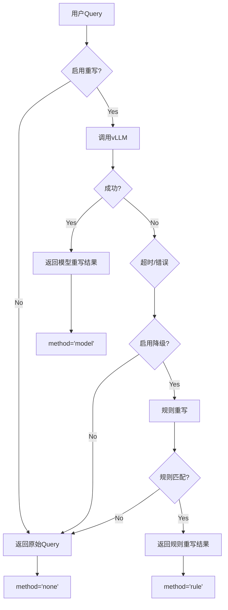

# DeepRetrieval × LangChain-Chatchat 集成架构详解

> 可视化系统架构和数据流

---

## 🏗️ 整体架构

```
┌─────────────────────────────────────────────────────────────────┐
│                         用户交互层                               │
│  ┌──────────┐      ┌──────────┐      ┌──────────┐              │
│  │  Web UI  │      │   API    │      │  移动端  │              │
│  └─────┬────┘      └─────┬────┘      └─────┬────┘              │
│        │                 │                  │                    │
│        └─────────────────┴──────────────────┘                    │
└─────────────────────────────┬───────────────────────────────────┘
                              │
                              ▼
┌─────────────────────────────────────────────────────────────────┐
│              LangChain-Chatchat 核心服务                        │
│                                                                   │
│  ┌────────────────────────────────────────────────────────────┐ │
│  │                    API Router                              │ │
│  │  /chat/kb_chat  │  /chat/file_chat  │  /knowledge_base   │ │
│  └──────────────────┬─────────────────────────────────────────┘ │
│                     │                                             │
│  ┌──────────────────▼─────────────────────────────────────────┐ │
│  │              Chat Handler (kb_chat.py)                     │ │
│  │                                                             │ │
│  │  1. 接收用户Query                                          │ │
│  │  2. 调用Query重写中间件 ◄───────┐                         │ │
│  │  3. 向量检索                    │                          │ │
│  │  4. 生成回答                    │                          │ │
│  └──────────────────┬─────────────┼──────────────────────────┘ │
│                     │             │                             │
│  ┌──────────────────▼─────────────┼──────────────────────────┐ │
│  │     ┌─────────────────────────┐│                          │ │
│  │     │ QueryRewriterMiddleware ││  ◄── ⭐ 核心集成点       │ │
│  │     └─────────────┬───────────┘│                          │ │
│  │                   │             │                          │ │
│  │         ┌─────────▼─────────┐   │                          │ │
│  │         │ Model Rewrite?    │   │                          │ │
│  │         └─────────┬─────────┘   │                          │ │
│  │            Yes    │     No      │                          │ │
│  │         ┌─────────▼─────────┐   │                          │ │
│  │         │ Rule-based?       │───┘                          │ │
│  │         └─────────┬─────────┘                              │ │
│  │                   │                                         │ │
│  │                   └─► Original Query (降级)                │ │
│  │                                                             │ │
│  └──────────────────┬──────────────────────────────────────┘  │
│                     │                                          │
│  ┌──────────────────▼──────────────────────────────────────┐  │
│  │           Knowledge Base Service                        │  │
│  │  ┌────────────┐  ┌────────────┐  ┌────────────┐        │  │
│  │  │   FAISS    │  │   Milvus   │  │  Chroma    │        │  │
│  │  └────────────┘  └────────────┘  └────────────┘        │  │
│  └──────────────────┬──────────────────────────────────────┘  │
└────────────────────┬┴──────────────────────────────────────────┘
                     │
                     ▼
        ┌────────────────────────┐
        │   向量数据库 / 知识库   │
        └────────────────────────┘


                              ║
                              ║  gRPC / HTTP
                              ║
                              ▼

┌─────────────────────────────────────────────────────────────────┐
│              DeepRetrieval 查询重写服务                         │
│                                                                   │
│  ┌────────────────────────────────────────────────────────────┐ │
│  │                     vLLM Server                            │ │
│  │                  (port: 8001)                              │ │
│  │                                                             │ │
│  │  ┌──────────────────────────────────────────────────────┐ │ │
│  │  │  Model: DeepRetrieval Fine-tuned LLM                 │ │ │
│  │  │  (基于Qwen2/DeepSeek等训练)                          │ │ │
│  │  └──────────────────────────────────────────────────────┘ │ │
│  │                                                             │ │
│  │  API: /v1/chat/completions (OpenAI Compatible)            │ │
│  └────────────────────────────────────────────────────────────┘ │
└─────────────────────────────────────────────────────────────────┘
```

---

## 🔄 数据流详解

### 完整请求流程

```
用户输入: "胶原蛋白怎么吃"
   │
   ▼
┌──────────────────────────────────┐
│ 1. LangChain-Chatchat接收请求   │
│    POST /chat/kb_chat             │
│    {                              │
│      "query": "胶原蛋白怎么吃",   │
│      "kb_name": "wuboshi_faq"     │
│    }                              │
└───────────────┬──────────────────┘
                │
                ▼
┌──────────────────────────────────┐
│ 2. 进入kb_chat处理函数           │
│    async def kb_chat(...)         │
└───────────────┬──────────────────┘
                │
                ▼
┌──────────────────────────────────────────────────────────────┐
│ 3. 调用QueryRewriterMiddleware                              │
│                                                               │
│    rewriter = get_query_rewriter()                          │
│    result = rewriter.rewrite("胶原蛋白怎么吃")              │
│                                                               │
│    ┌─────────────────────────────────────────────────────┐  │
│    │ 3a. 尝试模型重写                                    │  │
│    │     POST http://localhost:8001/v1/chat/completions │  │
│    │     {                                                │  │
│    │       "model": "query-rewrite",                     │  │
│    │       "messages": [{                                │  │
│    │         "role": "user",                             │  │
│    │         "content": "优化查询: 胶原蛋白怎么吃"       │  │
│    │       }]                                             │  │
│    │     }                                                │  │
│    │                                                       │  │
│    │     ↓ (145ms)                                        │  │
│    │                                                       │  │
│    │     Response:                                        │  │
│    │     "胶原蛋白肽 使用方法 推荐用量 适用人群"         │  │
│    └─────────────────────────────────────────────────────┘  │
│                                                               │
│    返回:                                                     │
│    {                                                          │
│      "original": "胶原蛋白怎么吃",                           │
│      "rewritten": "胶原蛋白肽 使用方法 推荐用量 适用人群",   │
│      "method": "model",                                      │
│      "success": true,                                        │
│      "latency_ms": 145                                       │
│    }                                                          │
└───────────────────────┬──────────────────────────────────────┘
                        │
                        ▼
┌──────────────────────────────────────────────────────────────┐
│ 4. 使用重写后的Query进行向量检索                            │
│                                                               │
│    docs = search_docs(                                       │
│        query="胶原蛋白肽 使用方法 推荐用量 适用人群",        │
│        kb_name="wuboshi_faq",                                │
│        top_k=5                                               │
│    )                                                          │
│                                                               │
│    ↓                                                          │
│                                                               │
│    向量数据库返回Top-5文档:                                  │
│    [                                                          │
│      {                                                        │
│        "content": "富铁软糖使用方法为每天推荐3粒...",        │
│        "score": 0.89,                                        │
│        "metadata": {...}                                     │
│      },                                                       │
│      ...                                                      │
│    ]                                                          │
└───────────────────────┬──────────────────────────────────────┘
                        │
                        ▼
┌──────────────────────────────────────────────────────────────┐
│ 5. 构建Prompt并调用LLM生成回答                               │
│                                                               │
│    prompt = f"""                                             │
│    参考以下内容回答用户问题:                                 │
│    {docs}                                                     │
│                                                               │
│    用户问题: 胶原蛋白怎么吃                                  │
│    """                                                        │
│                                                               │
│    answer = llm.generate(prompt)                             │
└───────────────────────┬──────────────────────────────────────┘
                        │
                        ▼
┌──────────────────────────────────────────────────────────────┐
│ 6. 返回最终结果给用户                                        │
│    {                                                          │
│      "answer": "胶原蛋白肽的使用方法为...",                  │
│      "docs": [...],                                           │
│      "query_rewrite": {                                      │
│        "original": "胶原蛋白怎么吃",                         │
│        "rewritten": "胶原蛋白肽 使用方法..."                 │
│      }                                                        │
│    }                                                          │
└──────────────────────────────────────────────────────────────┘
```

---

## 🧩 核心组件详解

### 1. QueryRewriterMiddleware

```
QueryRewriterMiddleware
│
├─ 配置管理
│  ├─ enable: bool           # 总开关
│  ├─ api_url: str           # vLLM地址
│  ├─ timeout: float         # 超时时间
│  └─ fallback_enabled: bool # 降级开关
│
├─ 核心方法
│  ├─ rewrite(query) → dict
│  │  ├─ _model_rewrite()        # Level 1
│  │  ├─ _rule_based_rewrite()   # Level 2
│  │  └─ return original_query   # Level 3
│  │
│  ├─ _build_prompt(query)
│  └─ _parse_response(content)
│
└─ 辅助功能
   ├─ 缓存机制 (可选)
   ├─ 监控埋点
   └─ 日志记录
```

### 2. 三级降级机制



### 3. 配置继承链

```
Environment Variables (最高优先级)
   ↓ (覆盖)
YAML配置文件 (data/query_rewrite_settings.yaml)
   ↓ (覆盖)
Settings类默认值 (chatchat/settings.py)
   ↓ (覆盖)
Middleware默认值 (middleware/query_rewriter.py)
```

示例:
```python
# 优先级示例
export QUERY_REWRITE_ENABLE=true    # 最高优先级

# YAML配置
query_rewrite_settings:
  enable: false                      # 被环境变量覆盖

# Settings类
class QueryRewriteSettings:
    enable: bool = True               # 被YAML覆盖

# 最终生效: enable = true (环境变量)
```

---

## 📊 性能分析

### 延迟分解

```
总延迟 = Query重写延迟 + 向量检索延迟 + LLM生成延迟

┌────────────────────────────────────────────────┐
│  用户请求                                      │
│  │                                              │
│  ├─ Query重写 (100-300ms)                     │
│  │  ├─ 网络往返 (20-50ms)                     │
│  │  ├─ 模型推理 (80-200ms)                    │
│  │  └─ 解析响应 (10-50ms)                     │
│  │                                              │
│  ├─ 向量检索 (50-150ms)                       │
│  │  ├─ Query embedding (30-80ms)              │
│  │  └─ 向量搜索 (20-70ms)                     │
│  │                                              │
│  └─ LLM生成 (1000-3000ms)                     │
│     └─ Token生成                               │
│                                                 │
│  总计: 1150-3450ms                             │
│  (Query重写占比: 8-10%)                        │
└────────────────────────────────────────────────┘
```

**优化建议**:
1. Query重写采用异步调用,不阻塞主流程
2. 启用缓存,命中率可达40-60%
3. 超时时间设为2s,快速降级

### 资源消耗

```
┌─────────────────────────────────────────┐
│  vLLM服务 (DeepRetrieval)               │
│  ├─ GPU内存: 8-16GB (7B模型)           │
│  ├─ CPU: 4-8核                          │
│  └─ 并发能力: 10-50 QPS                │
└─────────────────────────────────────────┘

┌─────────────────────────────────────────┐
│  LangChain-Chatchat                     │
│  ├─ 额外内存: +100MB (中间件)          │
│  ├─ 额外CPU: 微乎其微                  │
│  └─ 网络: +1个HTTP连接                 │
└─────────────────────────────────────────┘
```

---

## 🔐 安全架构

### 网络隔离

```
Internet
   │
   ▼
┌─────────────────────┐
│  Nginx / 反向代理   │  ← 公网访问
└──────────┬──────────┘
           │
           ▼
┌─────────────────────┐
│ LangChain-Chatchat  │  ← 内网服务
│  (port: 7861)       │
└──────────┬──────────┘
           │
           │  仅内网访问
           ▼
┌─────────────────────┐
│ DeepRetrieval vLLM  │  ← 内网服务
│  (port: 8001)       │     不对外暴露
└─────────────────────┘
```

### 访问控制

```python
# 在QueryRewriterMiddleware中添加认证
class QueryRewriterMiddleware:
    def __init__(self, api_key: str = None):
        self.api_key = api_key or os.getenv("VLLM_API_KEY")
        
        self.client = OpenAI(
            api_key=self.api_key,  # 添加认证
            base_url=api_url
        )
```

---

## 📈 监控架构

### 监控指标体系

```
┌─────────────────────────────────────────────────────────┐
│                    监控中心                              │
│                                                           │
│  ┌──────────────┐  ┌──────────────┐  ┌──────────────┐  │
│  │  性能指标    │  │  业务指标    │  │  质量指标    │  │
│  ├──────────────┤  ├──────────────┤  ├──────────────┤  │
│  │ - 延迟       │  │ - 请求量     │  │ - 成功率     │  │
│  │ - QPS        │  │ - 用户数     │  │ - 准确率     │  │
│  │ - 并发数     │  │ - 活跃度     │  │ - 满意度     │  │
│  └──────────────┘  └──────────────┘  └──────────────┘  │
│                                                           │
│  ┌─────────────────────────────────────────────────────┐│
│  │               告警规则                               ││
│  │  - 成功率 < 90% → 发送告警                          ││
│  │  - 延迟 > 1s (P95) → 发送告警                       ││
│  │  - 服务不可用 → 立即告警                            ││
│  └─────────────────────────────────────────────────────┘│
└───────────────────────────────────────────────────────────┘
```

### 日志架构

```
┌─────────────────────────────────────────┐
│  应用日志                                │
│                                           │
│  kb_chat.py:                             │
│    🔄 [Query重写] model (145ms):        │
│       '胶原蛋白怎么吃' ->                │
│       '胶原蛋白肽 使用方法...'          │
│                                           │
│  query_rewriter.py:                      │
│    ✓ 调用vLLM成功                        │
│    ✗ 超时,降级到规则重写                │
└───────────────┬─────────────────────────┘
                │
                ▼
┌─────────────────────────────────────────┐
│  日志聚合 (可选)                         │
│  - ELK Stack                             │
│  - Grafana Loki                          │
│  - 阿里云日志服务                        │
└─────────────────────────────────────────┘
```

---

## 🎯 部署架构

### 单机部署

```
┌────────────────────────────────────────┐
│           单台服务器                    │
│                                          │
│  ┌────────────────────────────────────┐│
│  │  LangChain-Chatchat                ││
│  │  CPU: 8核                          ││
│  │  RAM: 16GB                         ││
│  │  Port: 7861                        ││
│  └────────────────────────────────────┘│
│                                          │
│  ┌────────────────────────────────────┐│
│  │  DeepRetrieval vLLM                ││
│  │  GPU: 1 x A100 (40GB)              ││
│  │  CPU: 16核                         ││
│  │  RAM: 64GB                         ││
│  │  Port: 8001                        ││
│  └────────────────────────────────────┘│
└────────────────────────────────────────┘

适用场景: 开发测试、小规模生产(< 100用户)
```

### 分布式部署

```
┌─────────────────┐
│  负载均衡器     │
│  (Nginx)        │
└────────┬────────┘
         │
    ┌────┴────┐
    │         │
    ▼         ▼
┌────────┐ ┌────────┐
│ Chat 1 │ │ Chat 2 │  LangChain-Chatchat集群
└───┬────┘ └───┬────┘
    │          │
    └────┬─────┘
         │
         ▼
┌─────────────────┐
│   vLLM集群      │
│  ┌───┐ ┌───┐   │
│  │ 1 │ │ 2 │   │  DeepRetrieval查询重写
│  └───┘ └───┘   │
└─────────────────┘

适用场景: 大规模生产(> 1000用户)
```

---

## 🔄 扩展架构

### 混合检索架构

```
用户Query
   │
   ▼
┌──────────────────────────────────────┐
│  Query重写模块                       │
│  original_query → rewritten_query   │
└───────┬──────────────────────────────┘
        │
        ├───────────────┬──────────────┐
        │               │              │
        ▼               ▼              ▼
   ┌─────────┐    ┌─────────┐   ┌─────────┐
   │ 路径1:  │    │ 路径2:  │   │ 路径3:  │
   │ 原始    │    │ 重写    │   │ 扩展    │
   │ Query   │    │ Query   │   │ Query   │
   └────┬────┘    └────┬────┘   └────┬────┘
        │              │              │
        ▼              ▼              ▼
   ┌─────────────────────────────────────┐
   │      向量检索                        │
   │  results_1  results_2  results_3    │
   └───────┬─────────────────────────────┘
           │
           ▼
   ┌─────────────────┐
   │  结果融合(RRF)  │
   │  - Reciprocal   │
   │  - Weighted     │
   │  - Cascade      │
   └───────┬─────────┘
           │
           ▼
   ┌─────────────────┐
   │   重排序(可选)  │
   │  - Cross-Encoder│
   │  - Reranker     │
   └───────┬─────────┘
           │
           ▼
      最终Top-K文档
```

---

## 💡 最佳实践建议

### 1. 配置最佳实践

```yaml
# 生产环境推荐配置
query_rewrite_settings:
  enable: true
  api_url: "http://internal-vllm:8001/v1"  # 使用内网域名
  timeout: 1.5  # 适中的超时时间
  fallback_enabled: true  # 务必启用
  
  cache:
    enabled: true  # 启用缓存
    max_size: 5000  # 根据内存调整
    ttl: 3600
```

### 2. 监控最佳实践

```python
# 关键指标监控
metrics = {
    "query_rewrite_latency_p95": 300,  # ms
    "query_rewrite_success_rate": 0.95,  # 95%
    "fallback_rate": 0.05,  # 5%
    "cache_hit_rate": 0.4,  # 40%
}

# 告警阈值
alerts = {
    "success_rate_threshold": 0.90,  # < 90% 告警
    "latency_threshold_ms": 500,  # > 500ms 告警
    "service_down": True,  # 服务不可用立即告警
}
```

### 3. 容量规划

```python
# 单vLLM实例容量评估
capacity_per_instance = {
    "qps": 20,  # 查询/秒
    "concurrent_requests": 10,
    "avg_latency_ms": 200,
    "gpu_memory_gb": 16,  # 7B模型
}

# 根据业务需求计算实例数
target_qps = 100
instances_needed = ceil(target_qps / capacity_per_instance["qps"])
# = 5个实例
```

---

## 📚 总结

本集成架构的核心特点:

✅ **模块化**: 中间件独立,易于维护  
✅ **高可用**: 三级降级,保证稳定性  
✅ **可观测**: 完整的监控和日志  
✅ **可扩展**: 支持分布式部署  
✅ **高性能**: 查询重写延迟<300ms  

适用于各种规模的生产环境部署!

